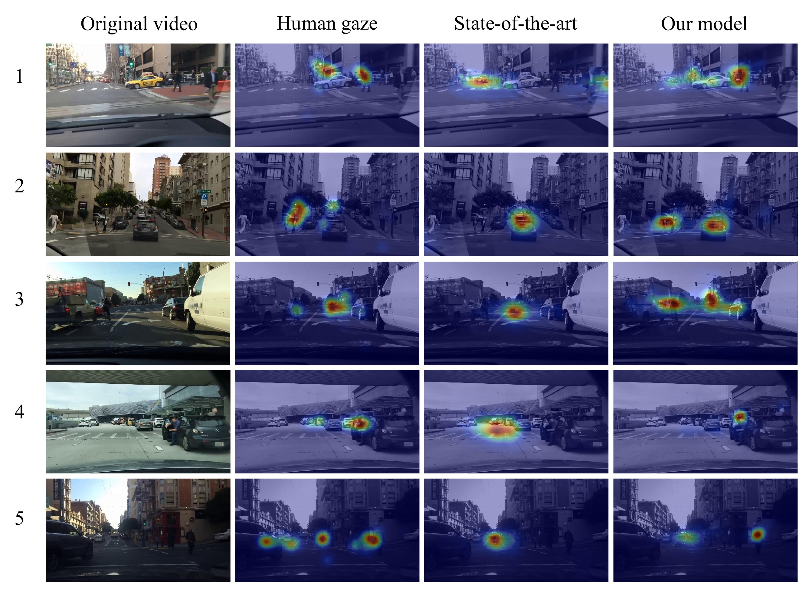

# Driver Attention Prediction Model

## Project Introduction:

This project accompanies the paper **_Training a network to attend like human drivers saves it from common but misleading loss functions_** (https://arxiv.org/abs/1711.06406)

## Demo:

### Video demos 

### Model structure

## Using Our Code:
### Installation
Make sure you have nvdia-docker installed. Then you can just use the docker image blindgrandpa/tf130_keras to run our code.

### Use our model to do inference on your videos
If you want to use our model to generate predicted driver attention maps for your videos, please follow the steps below. 

1. Put your videos into the directory ./data/application/camera_videos/

2. Parse your videos into frames. Modify the parameter settings in parse_video.py to specify the suffix of your video files and at which frame rate you want to generate prediction. A sampling rate of 3 Hz is recommended.

3. Download the pre-trained weights. Download [this zip file](https://drive.google.com/file/d/1QWFL6-HJGtjgGQop-YSf4oYj-2PIbNJH/view?usp=sharing) and unzip it under the "logs" directory

4. Run "lstm_full_prediction.py" with the following flags:  
     --batch_size=1  
     --model_dir=logs/pre-trained/  
     --encoder=alex  
     --readout=big_conv_lstm  
     and other flags that you may need.  
   If your videos are too long, you may want to set the "--longest_seq" flag to avoid memory errors.  
   Your command may look like this:  
   python lstm_full_prediction.py --batch_size=1 --model_dir=logs/pre-trained/ --encoder=alex --readout=big_conv_lstm  
   The output will be saved at logs/pre-trained/prediction_iter_10000/
   
